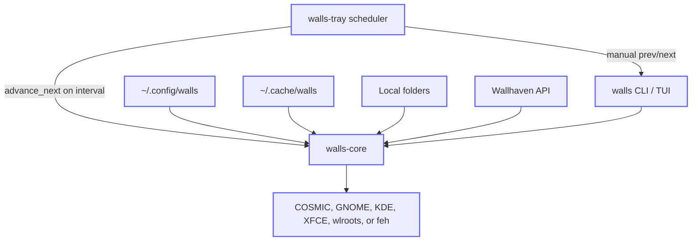

# walls

Personal wallpaper manager (Rust). JSON config under `~/.config/walls`, COSMIC + Wallhaven-first.

## Scope

**walls is:** a small daily-driver for rotating wallpapers — local folders, Wallhaven search/cache, CLI + TUI + tray, and an in-process rotation scheduler (Variety-style `change.interval_secs` from config). Apply targets **COSMIC** first (`cosmic-ext-bg-ctl` + RON patch), GNOME-family desktops via `gsettings`, KDE Plasma via `dbus-send`, XFCE via `xfconf-query`, sway/wlroots/Hyprland via `swaymsg` or `swaybg`, with **feh/nitrogen** fallback when detection does not find a native backend. Custom apply scripts are supported as [trusted user code](docs/security.md#custom-apply-scripts).

**walls is not:** a [Variety](https://github.com/varietywalls/variety) clone. There is no quotes/clock overlay pipeline and no broad multi-DE matrix beyond the tracked apply backend work ([v0.5 milestone](https://github.com/willfish/walls/milestone/4), [apply backend matrix](docs/apply-backends.md)). Image effects are opt-in and intentionally small while the [v0.6 pipeline](https://github.com/willfish/walls/milestone/5) lands. PRs welcome, but the 1.0 bar is “install and rotate on COSMIC/GNOME-family/KDE/XFCE/sway/Hyprland desktops (or feh fallback)”. [Roadmap issues](https://github.com/willfish/walls/issues?q=is%3Aopen+label%3Aepic).

**MSRV:** `1.86` (workspace `rust-version`). **License:** MIT. See [CHANGELOG](CHANGELOG.md) for release history.

## Install

### Nix (recommended)

```bash
nix build github:willfish/walls#walls
# binaries: result/bin/walls, result/bin/walls-tray

# or from a clone:
cd walls && nix build .#walls
```

Add `walls` and `walls-tray` to `home.packages` and enable the tray — see [`docs/home-manager.example.nix`](docs/home-manager.example.nix). Rotation interval lives in `config.json` (`change.interval_secs`); `walls-tray` runs the scheduler while the session is active.

### Cargo (from source)

```bash
git clone https://github.com/willfish/walls.git && cd walls
nix develop   # optional: hooks, cosmic-bg, feh for local apply tests
cargo install --path crates/cli --locked
cargo install --path crates/tray --locked
```

On Linux, `walls-tray` needs GTK/libappindicator (see `flake.nix` `linuxTrayDeps`).

### Config

```bash
mkdir -p ~/.config/walls
cp config.example.json ~/.config/walls/config.json
cp secrets.example.json ~/.config/walls/secrets.json   # wallhaven_api_key for online next
```

## Architecture

Component flow (source: [`docs/diagrams/architecture.mmd`](docs/diagrams/architecture.mmd)):



- **Config** — `config.json`, `secrets.json`, locked `state.json` (history, queue, current).
- **Cache** — downloaded Wallhaven images and composed outputs.
- **Triggers** — `walls-tray` polls `change.interval_secs` and calls `advance_next`; tray menu runs manual `prev` / `next` / `toggle-pause` and opens TUI. TUI runs the scheduler only when the tray did not start.

### TUI layout (`walls tui`)

Terminal screen regions (not a second runtime — same `walls` binary as the CLI). See [`docs/tui.md`](docs/tui.md) for the TUI architecture, style, layout, preview, and verification contracts.

```
┌ walls ────────────────────────────────────────────────┐
│ [Status][Now][History][Browse][Search]     1-5 tabs   │
├───────────────────────────────────────────────────────┤
│ > list (tab-specific)                                 │
│   Status   paused, paths, queue count                 │
│   Now      current wallpaper paths                    │
│   History  j/k · Enter apply                          │
│   Browse   queue · locals · history · Enter apply     │
│   Search   i query · Enter search/apply (API key)     │
├ keys ─────────────────────────────────────────────────┤
│ n/p  f/d  space  :  q                                 │
└───────────────────────────────────────────────────────┘
  :next :prev :pause :status :quit   (Esc cancels : mode)
```

## Development (Nix)

```bash
cd ~/Repositories/walls
direnv allow   # if using direnv — loads flake via .envrc
nix develop    # installs git pre-commit + pre-push hooks (see flake.nix)

cargo build
cargo test           # integration tests (core + CLI + TUI smoke)
cargo test -p walls-tray   # tray helper tests + tray build
nix build .#checks.x86_64-linux.default   # Nix package + tests (PTY test skipped in sandbox)
```

CI (GitHub Actions) runs rustfmt, clippy, `cargo test`, `cargo llvm-cov` summary reporting, release build, `cargo audit` / `cargo deny`, secret scan, and Nix builds on `x86_64-linux`, `aarch64-linux`, `x86_64-darwin`, and `aarch64-darwin`.

**Local hooks** (Nix-managed, like [forte#194](https://github.com/willfish/forte/pull/194)): on `nix develop` / direnv, **commit** runs hygiene + `nixfmt` + `rustfmt` + `actionlint` + shell checks; **push** runs `clippy` and `cargo test --workspace`. Run everything with `nix fmt` or `pre-commit run -a`.

## Demo

CLI workflow (isolated config; `custom-script` apply). The TUI uses the terminal alternate screen — record it with [`demo/record-tui.sh`](demo/record-tui.sh) (gpu-screen-recorder), or validate headless with [`scripts/validate-tui-pty.sh`](scripts/validate-tui-pty.sh).


Regenerate: `nix-shell -p asciinema asciinema-agg --run './demo/record-cli.sh'`

## Quick start

After [install](#install):

```bash
walls apply ~/Pictures/wallpaper.jpg
walls next
walls status
walls tui          # or: walls (no args, on a TTY)
walls-tray         # tray menu → walls prev/next/toggle-pause
```

## Commands

| Command | Status |
|---------|--------|
| `walls apply <path>` | Works |
| `walls status [--json]` | Works |
| `walls current [--meta]` | Works |
| `walls favorite` | Works |
| `walls fetch <paths...> [--move]` | Works |
| `walls trash` | Works |
| `walls config validate` | Works |
| `walls config sync` | Reconcile tray autostart desktop entry with `config.json` |
| `walls pause` / `walls resume` / `walls toggle-pause` | Works |
| `walls next [--manual] [--refresh <level>]` / `walls prev` | Works (auto `next` respects pause/rotation-off; `--manual` for explicit changes; refresh levels: `all`, `filters-and-texts`, `texts`, `clock-only`) |
| `walls tui` | Works — tabs: Status/Now/History/Browse/Search; `:` commands; `f`/`d` favorite/trash |
| `walls tui` with `--features tui-preview` | Optional Now-tab image preview in terminals supporting Kitty graphics (Ghostty/Kitty) or iTerm2 inline images; metadata-only fallback otherwise; set `WALLS_TUI_PREVIEW=0` to force metadata-only |
| `walls-tray` | Works (prev/next/pause, Open TUI, brand tray icon from `assets/icons/walls-tray.svg`) |

**Terminal for tray “Open TUI”** (precedence order):

1. `WALLS_TUI_CMD` — full override; `{walls}` is substituted (e.g. `ghostty -e {walls} tui`)
2. `$TERMINAL` — if set in the tray process environment (e.g. systemd `Environment=TERMINAL=ghostty`)
3. `xdg-terminal-exec` — system default terminal when on `PATH` (typical on modern Linux desktops)
4. `alacritty` — last-resort fallback

The **desktop launcher** (`walls.desktop`, installed on Linux via Nix) uses `Terminal=true`, so your desktop’s default terminal emulator runs `walls tui` — no extra config.

Tray/desktop icon SVGs live under `assets/icons/` (`walls-tray.svg` for launchers and the active tray icon, `walls-tray-paused.svg` when rotation is inactive). Rebuild `walls-tray` after editing. Set `WALLS_TRAY_WALLPAPER_THUMBNAIL=1` to restore the old live-wallpaper thumbnail icon (paused still uses the paused brand icon).

## Automatic rotation

Configure rotation in `config.json`:

- `change.enabled` — master switch
- `change.interval_secs` — seconds between automatic changes (tray scheduler)
- `change.on_start` — change once when `walls-tray` starts
- `tray.autostart.desktops` — per-desktop login autostart for `walls-tray` (synced to `~/.config/autostart/walls-tray.desktop`; toggle in TUI Config → Rotation)

`walls pause` stops automatic rotation; use `walls next --manual` (or tray/TUI next) while paused.

`walls config sync` reconciles the tray autostart entry after hand-editing `config.json`. Autostart is skipped on desktops where tray is unavailable (Awesome, Fluxbox, Enlightenment, Trinity, Lingmo).

Optional legacy `systemd/` units remain for headless setups without a tray host; prefer the tray scheduler when a graphical session is available.

See `docs/home-manager.example.nix` for a home-manager sketch.
