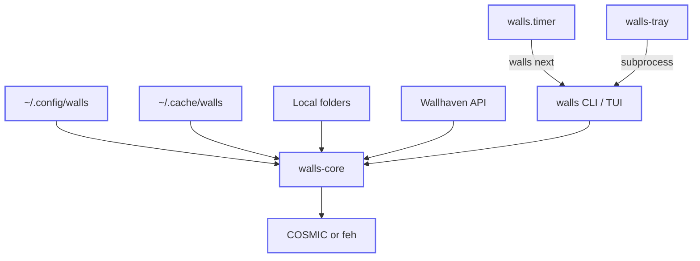

# walls

Personal wallpaper manager (Rust). JSON config under `~/.config/walls`, COSMIC + Wallhaven-first.

## Architecture

Component flow (source: [`docs/diagrams/architecture.mmd`](docs/diagrams/architecture.mmd)):



- **Config** — `config.json`, `secrets.json`, locked `state.json` (history, queue, current).
- **Cache** — downloaded Wallhaven images and composed outputs.
- **Triggers** — `walls.timer` runs `walls next`; tray runs `walls prev` / `next` / `toggle-pause` / opens TUI.

### TUI layout (`walls tui`)

Terminal screen regions (not a second runtime — same `walls` binary as the CLI):

```
┌ walls ────────────────────────────────────────────────┐
│ [Status][Now][History][Browse][Search]     1-5 tabs   │
├───────────────────────────────────────────────────────┤
│ > list (tab-specific)                                 │
│   Status   paused, paths, queue count                 │
│   Now      current wallpaper paths                    │
│   History  j/k · Enter apply                          │
│   Browse   queue · locals · history · Enter apply     │
│   Search   i query · Enter search/apply (API key)     │
├ keys ─────────────────────────────────────────────────┤
│ n/p  f/d  space  :  q                                 │
└───────────────────────────────────────────────────────┘
  :next :prev :pause :status :quit   (Esc cancels : mode)
```

## Development (Nix)

```bash
cd ~/Repositories/walls
direnv allow   # if using direnv — loads flake via .envrc
nix develop    # installs git pre-commit + pre-push hooks (see flake.nix)

cargo build
cargo test           # integration tests (core + CLI + TUI smoke)
cargo test -p walls-tray   # tray builds; no automated tests yet
nix build .#checks.x86_64-linux.default   # Nix package + tests (PTY test skipped in sandbox)
```

CI (GitHub Actions) runs rustfmt, clippy, `cargo test`, release build, `cargo audit` / `cargo deny`, secret scan, and Nix builds on `x86_64-linux`, `aarch64-linux`, `x86_64-darwin`, and `aarch64-darwin`.

**Local hooks** (Nix-managed, like [forte#194](https://github.com/willfish/forte/pull/194)): on `nix develop` / direnv, **commit** runs hygiene + `nixfmt` + `rustfmt` + `actionlint` + shell checks; **push** runs `clippy` and `cargo test --workspace`. Run everything with `nix fmt` or `pre-commit run -a`.

## Quick start

```bash
cargo build --release
mkdir -p ~/.config/walls
cp config.example.json ~/.config/walls/config.json
cp secrets.example.json ~/.config/walls/secrets.json   # add wallhaven_api_key for online next
walls apply ~/Pictures/wallpaper.jpg
walls next
walls status
walls tui          # or: walls (no args, on a TTY)
walls-tray         # tray menu → walls prev/next/toggle-pause
```

## Commands

| Command | Status |
|---------|--------|
| `walls apply <path>` | Works |
| `walls status [--json]` | Works |
| `walls current [--meta]` | Works |
| `walls favorite` | Works |
| `walls fetch <paths...> [--move]` | Works |
| `walls trash` | Works |
| `walls config validate` | Works |
| `walls pause` / `walls resume` / `walls toggle-pause` | Works |
| `walls next` / `walls prev` | Works (local + Wallhaven cache queue) |
| `walls tui` | Works — tabs: Status/Now/History/Browse/Search; `:` commands; `f`/`d` favorite/trash |
| `walls-tray` | Works (prev/next/pause, Open TUI, thumbnail icon) |

Set `WALLS_TUI_CMD` to override the terminal launch command (`{walls}` is substituted). Defaults to `$TERMINAL -e walls tui` (terminal: `alacritty`).

## systemd timer

User units live in `systemd/`. Install `walls.service`, `walls.timer`, and optionally `walls-tray.service` under `~/.config/systemd/user/`, then:

```bash
systemctl --user daemon-reload
systemctl --user enable --now walls.timer
systemctl --user enable --now walls-tray.service
```

Rotation interval is configured in the **timer unit** (or home-manager), not in `config.json`. `walls pause` makes `walls next` a no-op (exit 0).

See `docs/home-manager.example.nix` for a home-manager sketch.
