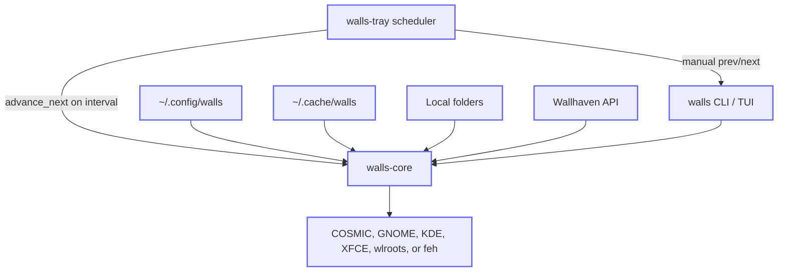

# walls

`walls` is a Rust wallpaper manager for Linux desktops: local folders, Wallhaven
search/cache, a keyboard-first TUI, tray controls, and automatic rotation from a
small JSON config under `~/.config/walls`.

It is built around the way I actually use wallpapers: COSMIC first, Nix-friendly,
scriptable from the CLI, and quiet enough to leave running all day.

## Fastest Path To A Working Wallpaper

From a clone, this is the shortest reliable path to install, create config, check
the machine, and apply one known local image:

```bash
nix develop
cargo install --path crates/cli --locked
cargo install --path crates/tray --locked

mkdir -p ~/.config/walls
cp config.example.json ~/.config/walls/config.json
cp secrets.example.json ~/.config/walls/secrets.json

walls doctor
walls apply ~/Pictures/wallpaper.jpg
walls current
walls tui
```

Expected shape:

```text
$ walls doctor
walls doctor: ready
...

$ walls apply ~/Pictures/wallpaper.jpg
/home/alex/Pictures/wallpaper.jpg

$ walls current
/home/alex/Pictures/wallpaper.jpg
```

If a step fails, run `walls doctor` first and follow its `fix:` lines. For
journey-led setup and recovery paths, see:

- [First install and first wallpaper](docs/journeys.md#first-install-and-first-wallpaper)
- [Local-only rotation](docs/journeys.md#local-only-rotation-from-a-folder)
- [Online providers](docs/journeys.md#online-providers)
- [Tray and autostart](docs/journeys.md#tray-and-autostart)
- [TUI usage and config editing](docs/journeys.md#tui-usage-and-config-editing)
- [Cache and quota management](docs/journeys.md#cache-and-quota-management)
- [CLI scripting and JSON output](docs/journeys.md#cli-scripting-and-json-output)
- [Troubleshooting guide](docs/troubleshooting.md)


## What It Does

- Rotates wallpapers from local folders and online providers.
- Applies wallpapers on COSMIC, GNOME-family desktops, KDE Plasma, XFCE,
  sway/wlroots/Hyprland, or `feh`/`nitrogen` fallback.
- Provides the same workflow through `walls` CLI commands, `walls tui`, and
  `walls-tray`.
- Keeps state in predictable config/cache/state directories instead of a hidden
  database.
- Supports custom apply scripts as [trusted user code](docs/security.md#custom-apply-scripts).

## Demo

The checked-in GIF shows the isolated CLI workflow: apply an image, inspect
status, pause rotation, and jump into the TUI entrypoint.

```bash
nix-shell -p asciinema asciinema-agg --run './demo/record-cli.sh'
```

The TUI uses the terminal alternate screen, so record it with portal-based screen
capture instead of asciinema:

```bash
nix-shell -p gpu-screen-recorder ffmpeg --run './demo/record-tui.sh'
```

Headless TUI behaviour is covered separately by `scripts/validate-tui-pty.sh`.

The TUI changes faster than a README GIF. Use `walls tui` and press `?` for
current key help; see [docs/tui.md](docs/tui.md) for design and verification
contracts.

## Scope And Non-Goals

**walls is:** a small daily-driver for rotating wallpapers — local folders, Wallhaven search/cache, CLI + TUI + tray, and an in-process rotation scheduler (Variety-style `change.interval_secs` from config). Apply targets **COSMIC** first (`cosmic-ext-bg-ctl` + RON patch), GNOME-family desktops via `gsettings`, KDE Plasma via `dbus-send`, XFCE via `xfconf-query`, sway/wlroots/Hyprland via `swaymsg` or `swaybg`, with **feh/nitrogen** fallback when detection does not find a native backend. Custom apply scripts are supported as [trusted user code](docs/security.md#custom-apply-scripts).

**walls is not:** a [Variety](https://github.com/varietywalls/variety) clone. There is no quotes/clock overlay pipeline and no broad multi-DE matrix beyond the tracked apply backend work ([v0.5 milestone](https://github.com/willfish/walls/milestone/4), [apply backend matrix](docs/apply-backends.md)). Image effects are opt-in and intentionally small while the [v0.6 pipeline](https://github.com/willfish/walls/milestone/5) lands. PRs welcome, but the 1.0 bar is “install and rotate on COSMIC/GNOME-family/KDE/XFCE/sway/Hyprland desktops (or feh fallback)”. [Roadmap issues](https://github.com/willfish/walls/issues?q=is%3Aopen+label%3Aepic).

**MSRV:** `1.86` (workspace `rust-version`). **License:** MIT. See [CHANGELOG](CHANGELOG.md) for release history.

## Install

### Nix (recommended)

```bash
nix build github:willfish/walls#walls
# binaries: result/bin/walls, result/bin/walls-tray

# or from a clone:
cd walls && nix build .#walls
```

Add `walls` and `walls-tray` to `home.packages` and enable the tray — see [`docs/home-manager.example.nix`](docs/home-manager.example.nix). Rotation interval lives in `config.json` (`change.interval_secs`); `walls-tray` runs the scheduler while the session is active.

### Cargo (from source)

```bash
git clone https://github.com/willfish/walls.git && cd walls
nix develop   # optional: hooks, cosmic-bg, feh for local apply tests
cargo install --path crates/cli --locked
cargo install --path crates/tray --locked
```

On Linux, `walls-tray` needs GTK/libappindicator (see `flake.nix` `linuxTrayDeps`).

### Config

```bash
mkdir -p ~/.config/walls
cp config.example.json ~/.config/walls/config.json
cp secrets.example.json ~/.config/walls/secrets.json   # API keys: wallhaven (optional), unsplash/reddit (required when enabled)
```

Machine-readable JSON schemas are checked in for editor validation and
declarative config tooling:

- [`docs/schemas/config.schema.json`](docs/schemas/config.schema.json)
- [`docs/schemas/secrets.schema.json`](docs/schemas/secrets.schema.json)

Keep the example `$schema` paths when copying from the repo, or replace them with
raw GitHub URLs when managing config outside the checkout.

Run `walls config validate` after hand-editing config or secrets.

## Architecture

Component flow (source: [`docs/diagrams/architecture.mmd`](docs/diagrams/architecture.mmd)):



- **Config** — `config.json`, `secrets.json`, locked `state.json` (history, queue, current).
- **Cache** — downloaded Wallhaven images and composed outputs.
- **Triggers** — `walls-tray` polls `change.interval_secs` and calls `advance_next`; tray menu runs manual `prev` / `next`, favorites the current wallpaper, toggles pause, and opens TUI. On StatusNotifier tray hosts, wheel down/up over the tray icon runs the same manual next/previous actions. TUI runs the scheduler only when the tray did not start.

### TUI (`walls tui`)

`walls tui` is the same runtime as the CLI, presented as a keyboard-first
terminal control surface for current wallpaper state, history, browsing, search,
config editing, and logs. Press `?` inside the TUI for current key help rather
than relying on duplicated key tables in docs. See [`docs/tui.md`](docs/tui.md)
for architecture, style, layout, preview, and verification contracts.

## Development (Nix)

```bash
cd ~/Repositories/walls
direnv allow   # if using direnv — loads flake via .envrc
nix develop    # installs git pre-commit + pre-push hooks (see flake.nix)

cargo build
cargo test           # integration tests (core + CLI + TUI smoke)
cargo test -p walls-tray   # tray helper tests + tray build
cargo bench -p walls-core --bench hot_paths -- --sample-size 10 --measurement-time 1   # benchmark smoke run; see docs/benchmarks.md
nix build .#checks.x86_64-linux.default   # Nix package + tests (PTY test skipped in sandbox)
```

CI (GitHub Actions) runs rustfmt, clippy, `cargo test`, `cargo llvm-cov` with a documented [coverage floor](docs/coverage.md), release build, `cargo audit` / `cargo deny`, secret scan, and Nix builds on `x86_64-linux`, `aarch64-linux`, `x86_64-darwin`, and `aarch64-darwin`.

Rust conventions for module boundaries, errors, validation, provider I/O, and tests are documented in [`docs/rust-style.md`](docs/rust-style.md).

**Local hooks** (Nix-managed, like [forte#194](https://github.com/willfish/forte/pull/194)): on `nix develop` / direnv, **commit** runs hygiene + `nixfmt` + `rustfmt` + `actionlint` + shell checks; **push** runs `clippy` and `cargo test --workspace`. Run everything with `nix fmt` or `pre-commit run -a`.

## Journey Guides

Use the [journey guide](docs/journeys.md) when setting up a real machine or
recovering a broken workflow. It covers first install, local folders, online
providers, tray/autostart, apply backends, TUI config editing, cache/quota, and
JSON scripting. Use the [troubleshooting guide](docs/troubleshooting.md) when
you already have a symptom.

## Commands

| Command | Status |
|---------|--------|
| `walls apply <path>` | Works |
| `walls status [--json]` | Works |
| `walls doctor [--json]` | Check first-run readiness across config, desktop/apply, tray, providers, storage/cache, and TUI preview; exits non-zero when required checks fail |
| `walls current [--json] [--meta]` | Works (`--meta` is the legacy metadata-only JSON shape; prefer `--json` for scripts) |
| `walls favorite` | Works |
| `walls fetch <paths...> [--move]` | Works |
| `walls undo [--json]` | Restore the previous wallpaper from history |
| `walls trash [--dry-run] [--force] [--json]` | Delete the current wallpaper from disk/state; `--force` is required unless using `--dry-run` |
| `walls cache status [--json]` | Inspect queue length, provider cache/download counts, sizes, and quota usage |
| `walls cache inspect [--provider <name>] [--json]` | List provider cache/download files |
| `walls cache prune [--dry-run] [--force] [--json]` | Clear queued provider downloads first, or purge provider files when the queue is empty |
| `walls cache clear-queue [--dry-run] [--force] [--json]` | Clear queued provider downloads |
| `walls cache purge-provider-files [--dry-run] [--force] [--json]` | Remove provider cache files/downloads and prune affected state |
| `walls config validate [--json]` | Works |
| `walls config sync [--dry-run]` | Reconcile tray autostart desktop entry with `config.json`; preview file changes with `--dry-run` |
| `walls pause` / `walls resume` / `walls toggle-pause` | Works |
| `walls next [--manual] [--refresh <level>] [--verbose] [--json]` / `walls prev [--json]` | Works (auto `next` respects pause/rotation-off; `--manual` for explicit changes; `--verbose` prints provider attempts/skips/retries/fallbacks; refresh levels: `all`, `filters-and-texts`, `texts`, `clock-only`) |
| `walls tui` | Works — tabs: Config/Now/History/Browse/Search/Logs; `?` key help; `/` or `i` search; `:` commands; `f` favorite; `d` requests trash confirmation |
| `walls tui` with `--features tui-preview` | Optional Now-tab image preview in terminals supporting Kitty graphics (Ghostty/Kitty) or iTerm2 inline images; metadata-only fallback otherwise; set `WALLS_TUI_PREVIEW=0` to force metadata-only |
| `walls-tray` | Works (prev/next/favorite/pause, Open TUI, brand tray icon from `assets/icons/walls-tray.svg`; StatusNotifier wheel down/up runs next/previous) |

**Terminal for tray “Open TUI”** (precedence order):

1. `WALLS_TUI_CMD` — full override; `{walls}` is substituted (e.g. `ghostty -e {walls} tui`)
2. `$TERMINAL` — if set in the tray process environment (e.g. systemd `Environment=TERMINAL=ghostty`)
3. `xdg-terminal-exec` — system default terminal when on `PATH` (typical on modern Linux desktops)
4. `alacritty` — last-resort fallback

The **desktop launcher** (`walls.desktop`, installed on Linux via Nix) runs `xdg-terminal-exec --app-id=walls … tui`, so your configured default terminal opens the TUI with a stable app id — same mechanism as tray “Open TUI” when `xdg-terminal-exec` is on `PATH`.

Tray/desktop icon SVGs live under `assets/icons/` (`walls-tray.svg` for launchers and the active tray icon, `walls-tray-paused.svg` when rotation is inactive). Rebuild `walls-tray` after editing. Set `WALLS_TRAY_WALLPAPER_THUMBNAIL=1` to restore the old live-wallpaper thumbnail icon (paused still uses the paused brand icon).

Tray actions update the tray tooltip with the latest success, no-op, or failure message, and the pause menu label changes between pause/resume based on current state.

Tray scroll support is backend-specific: StatusNotifier exposes wheel events, so vertical scroll over the icon maps to next/previous wallpaper. The legacy AppIndicator backend used through `tray-icon` on Linux does not expose tray icon wheel events, so its behaviour remains menu-only.

## Automatic rotation

Configure rotation in `config.json`:

- `change.enabled` — master switch
- `change.interval_secs` — seconds between automatic changes (tray scheduler)
- `change.on_start` — change once when `walls-tray` starts
- `tray.autostart.desktops` — per-desktop login autostart for `walls-tray` (synced to `~/.config/autostart/walls-tray.desktop`; toggle in TUI Config → Rotation)

`walls pause` stops automatic rotation; use `walls next --manual` (or tray/TUI next) while paused.

`walls config sync --dry-run` previews the tray autostart file that would be
written or removed after hand-editing `config.json`; run without `--dry-run` to
apply it. Autostart is skipped on desktops where tray is unavailable (Awesome,
Fluxbox, Enlightenment, Trinity, Lingmo).

Optional legacy `systemd/` units remain for headless setups without a tray host; prefer the tray scheduler when a graphical session is available.

See `docs/home-manager.example.nix` for a home-manager sketch.

## First-run checks

Run `walls doctor` after installing or editing `config.json`. It groups readiness
checks by user journey and prints concrete fixes for failed or degraded checks,
such as `walls config sync`, missing provider credentials in `secrets.json`,
missing wallpaper backend commands, cache quota pressure, tray/autostart gaps, or
`WALLS_TUI_PREVIEW=0` when image preview is not wanted. Use
`walls doctor --json` for stable check IDs, sections, severities, statuses,
messages, and remediation text in scripts.

## CLI output contract

Human output stays compact and backwards-compatible: commands such as `walls next`,
`walls prev`, and `walls current` print the affected path or a short no-op message.
Use `--json` where available when scripting.

Structured command results use a stable envelope:

```json
{
  "command": "next",
  "changed": false,
  "status": "no_change",
  "path": null,
  "exit_code_reason": "no_change"
}
```

- `command` is the invoked command family, for example `next`, `prev`, or `current`.
- `changed` is `true` only when the command changed wallpaper state or applied a wallpaper.
- `status` is a stable machine-readable result such as `applied`, `refreshed`, `no_change`, `no_previous`, `current`, or `missing_current`.
- `path` is the affected wallpaper path for path-oriented commands, otherwise `null`.
- `current` is used by `walls current --json` and contains `path` plus metadata when present.
- `exit_code_reason` is `null` on normal success and a stable reason string for no-op or failure-like outcomes that scripts may branch on.

`walls current --json` exits non-zero with `status: "missing_current"` when no wallpaper is recorded. `walls next --json` and `walls prev --json` keep the existing successful no-op behavior for `no_change` and `no_previous`, while making the reason explicit.

`walls next --verbose` prints the provider attempt report in human form after
the normal path/no-op line. `walls next --json` includes the same data as
`provider_attempts`, including skipped providers, missing credentials, offline
providers, no-candidate results, retries/backoff, request status codes, and the
fallback provider tried next. `walls doctor --json` includes provider
`doctor_check` attempts for configured provider readiness without performing a
live fetch.

Cache commands use the same envelope and add cache-specific fields such as
`queue`, `cache`, `downloads`, `quota`, `plan`, and remove counts. Mutating cache
commands refuse to change state/files without `--force`; use `--dry-run` to see
the planned queue clear or provider-file purge.

`walls undo --json` uses `status: "restored_previous"` when it restores from
history. `walls trash --json` uses `status: "force_required"` and exits with code
2 when called without `--force`; `walls trash --dry-run --json` reports
`status: "would_trash"` plus the affected original/composed paths without
removing files or changing state.
