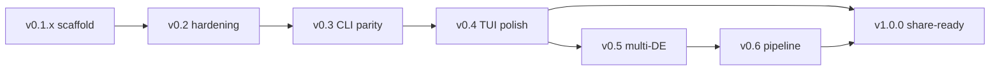

# walls — Roadmap to 1.0.0

**Goal:** Ship a share-ready wallpaper manager: CLI + systemd rotation + tray + TUI, COSMIC-first with a credible path to other desktops.

**Approach:** Treat M1–M5 as largely complete; focus v0.2–v0.4 on hardening and daily-driver polish (tray, timer, TUI, ops). Defer multi-DE and Variety-parity pipeline to v0.5–v0.6. Gate **1.0.0** on release hygiene, docs, and a defined minimum feature set—not full Variety parity.

**Key Files:**
- `crates/core/src/ctx.rs` — advance, apply, state (modify for locking)
- `crates/tray/src/main.rs` — tray UX (modify)
- `crates/cli/src/tui/` — TUI screens (modify)
- `systemd/walls.{service,timer}` — rotation (exists)
- `docs/home-manager.example.nix` — user install story (extend)
- `flake.nix` — Nix package `walls` + `walls-tray` (exists)

**Tech Notes:**
- Current version: `0.1.0` (workspace + flake).
- Tests: `nix develop -c cargo test` — core integration + CLI/TUI smoke; tray has no automated tests.
- Apply: COSMIC RON patch + `cosmic-ext-bg-ctl`; `auto` falls through to feh/nitrogen with a warning.
- Timer interval lives in **systemd/home-manager**, not `config.json`.
- Reference plans: `2026-06-01-walls-implementation-plan.md` (full Variety inventory), `2026-06-01-walls-m2-m5-execution-plan.md` (M2–M5 tasks — mostly done).

---

## Status review (2026-06-02)

### Documentation

| Asset | Status |
|-------|--------|
| `2026-06-01-walls-implementation-plan.md` | Comprehensive Variety→walls map; still marked **Draft** |
| `2026-06-01-walls-m2-m5-execution-plan.md` | Task-level M2–M5 plan; **implemented** |
| `README.md` | Accurate quick start, commands table, systemd, Nix hooks |
| `docs/home-manager.example.nix` | Timer + packages; no tray autostart unit yet |
| `config.example.json` / `secrets.example.json` | Present |

### Built (M1–M5 equivalent)

| Area | Done | Gaps |
|------|------|------|
| **Core** | Config/state/paths, pass-through pipeline, COSMIC apply, feh fallback, local sources, selection, Wallhaven client/refill/download/quota, `advance_next`/`prev` | No `fs2` state lock; `prev` history model is path-based |
| **CLI** | `apply`, `next`, `prev`, `status`, `pause`/`resume`/`toggle-pause`, TUI entry | No `favorite`, `fetch`, `trash`, `current`, `config validate` |
| **TUI** | Status, Now, History, Browse (queue + history), `n`/`p`/pause/j/k/enter | No Wallhaven search tab, `:` commands, image preview, favorite/trash |
| **Tray** | prev/next/toggle-pause via subprocess | 1×1 placeholder icon; `WALLS_BIN` manual; no “Open TUI”; no autostart unit |
| **Service** | `systemd/walls.service` + `walls.timer` | User must install paths; tray not in HM example |
| **CI / Nix** | Multi-arch CI, flake package, pre-commit/pre-push hooks | — |

### Milestone map (original → actual)

| Plan milestone | Actual |
|----------------|--------|
| M0 Plan | Done (docs) |
| M1 apply + COSMIC + config | Done |
| M2 local next/prev | Done |
| M3 Wallhaven | Done |
| M4 systemd + HM example | Done (units + sketch) |
| M5 tray + TUI | Done (minimal) |
| M6 multi-DE apply | Not started |
| M7 pipeline filters/display | Not started |
| M8 quotes/clock/remaining DEs | Not started |

---

## Version strategy



| Version | Theme | Share criteria |
|---------|-------|----------------|
| **v0.1.x** | COSMIC daily driver (current) | Personal use only |
| **v0.2.0** | Ops hardening | Reliable timer + tray + state under concurrency |
| **v0.3.0** | CLI parity (P1) | Manage library without TUI |
| **v0.4.0** | TUI polish | Browse/search wallpapers interactively |
| **v0.5.0** | Portability | GNOME/KDE/XFCE/sway/hyprland apply |
| **v0.6.0** | Effects | Filters + display modes (optional for 1.0) |
| **v1.0.0** | Public release | Docs, releases, MSRV, security baseline, defined scope |

**1.0.0 minimum scope (recommended):** v0.2 + v0.3 + v0.4 + README/HM install story + GitHub releases + CHANGELOG. v0.5/v0.6 can ship as 1.1+ unless you want “works on any Linux DE” for launch.

---

# v0.2.0 — Hardening & service integration

**Epic:** Reliable background rotation and tray for daily use.

### Task 1: State file exclusive lock

**Files:**
- Modify: `crates/core/Cargo.toml` — add `fs2 = "0.4"`
- Create: `crates/core/src/lock.rs`
- Modify: `crates/core/src/ctx.rs`, `crates/core/src/lib.rs`

```rust
// crates/core/src/lock.rs
use fs2::FileExt;
use std::fs::OpenOptions;
use std::path::Path;

pub struct StateLock {
    _file: std::fs::File,
}

impl StateLock {
    pub fn acquire(state_file: &Path) -> anyhow::Result<Self> {
        let file = OpenOptions::new()
            .read(true)
            .write(true)
            .create(true)
            .open(state_file)?;
        file.lock_exclusive()?;
        Ok(Self { _file: file })
    }
}
```

Wrap `advance_next`, `advance_prev`, `apply_file`, `toggle_pause` in `WallsCtx` with `let _lock = StateLock::acquire(&self.paths.state_file)?;`.

- [ ] Add `crates/core/tests/state_lock.rs` — two threads, one blocks
- [ ] `nix develop -c cargo test state_lock`
- [ ] Commit: `feat(core): exclusive lock on state.json`

### Task 2: Tray resolves `walls` binary

**Files:**
- Modify: `crates/tray/src/main.rs`

```rust
fn walls_bin() -> std::path::PathBuf {
    if let Ok(p) = std::env::var("WALLS_BIN") {
        return std::path::PathBuf::from(p);
    }
    if let Ok(exe) = std::env::current_exe() {
        let sibling = exe.parent().unwrap().join("walls");
        if sibling.is_file() {
            return sibling;
        }
    }
    std::path::PathBuf::from("walls")
}
```

- [ ] Manual: `nix build` → run `walls-tray` from `result/bin`
- [ ] Commit: `fix(tray): resolve walls binary beside tray`

### Task 3: Tray menu — Open TUI

**Files:**
- Modify: `crates/tray/src/main.rs`

Spawn terminal with TUI (configurable):

```rust
// env WALLS_TUI_CMD default: "xterm -e walls tui" or alacritty -e ...
```

- [ ] Document `WALLS_TUI_CMD` in README
- [ ] Commit: `feat(tray): open TUI in terminal`

### Task 4: Tray icon + tooltip from state

**Files:**
- Modify: `crates/tray/Cargo.toml` — optional `image` for resize
- Modify: `crates/tray/src/main.rs`

Load small PNG from `state.current.composed_path` if readable; else bundled default 32×32.

- [ ] Commit: `feat(tray): dynamic icon from current wallpaper`

### Task 5: systemd user units for tray

**Files:**
- Create: `systemd/walls-tray.service`
- Modify: `docs/home-manager.example.nix`

```ini
[Unit]
Description=walls system tray
After=graphical-session.target

[Service]
ExecStart=%h/.local/bin/walls-tray
Restart=on-failure
```

- [ ] Commit: `docs: walls-tray systemd and home-manager`

### Task 6: `walls config validate`

**Files:**
- Modify: `crates/cli/src/main.rs`
- Modify: `crates/core/src/config.rs` — `pub fn validate(cfg: &Config) -> Vec<String>`

Checks: sources have paths, wallhaven enabled needs key, cosmic path exists if backend cosmic.

- [ ] Test + commit: `feat(cli): config validate`

---

# v0.3.0 — CLI library management

**Epic:** Favorite, fetch, trash, current without TUI.

### Task 7: `walls current`

Print composed path; `--meta` JSON from state.

### Task 8: `walls favorite`

Copy current original to `favorites_dir` per config rules.

### Task 9: `walls fetch`

Move/copy paths into `fetched_dir`.

### Task 10: `walls trash`

Remove current from disk + history; advance or clear current.

Each task: failing integration test in `crates/core/tests/`, CLI wire-up, commit.

---

# v0.4.0 — TUI polish

**Epic:** Interactive browsing worth opening daily.

### Task 11: Browse shows local candidates

`App::browse_items()` calls `collect_local_candidates()` with section headers.

### Task 12: Wallhaven search screen (tab 5)

Input query, `rt.block_on(client.search)`, list results, Enter downloads + applies.

### Task 13: Command mode `:`

`:next`, `:prev`, `:pause`, `:status` — minimal parser in `tui/mod.rs`.

### Task 14: Optional Kitty/iTerm preview

Behind feature `tui-preview`; fallback unchanged.

### Task 15: TUI actions favorite/trash

Keys `f` / `d` call new core helpers from v0.3.

---

# v0.5.0 — Multi-DE apply (M6)

**Epic:** Portable beyond COSMIC.

Order: GNOME → KDE → XFCE → sway/wlroots/hyprland → mate/cinnamon.

Per backend PR:
- `crates/core/src/apply/<de>.rs`
- argv snapshot or fixture test
- Row in `docs/apply-backends.md`

`auto` detection must select real backend before feh fallback.

---

# v0.6.0 — Pipeline (M7)

**Epic:** Variety-style effects (optional post-1.0).

- `auto_rotate` (EXIF)
- Random enabled filters (ImageMagick)
- Display modes: zoom, fill-with-blur, etc.
- `walls next --refresh clock` refresh levels

---

# v1.0.0 — Share-ready release

**Epic:** Someone else can install and use it.

### Release checklist

- [ ] CHANGELOG.md from v0.1.0
- [ ] GitHub Release with `walls` + `walls-tray` binaries (Linux x86_64/aarch64) or Nix-only install doc
- [ ] README: install (Nix flake, cargo install path, HM module)
- [ ] Security: `cargo audit` / deny clean; secrets in docs
- [ ] MSRV documented (`rust-version` in workspace)
- [ ] License file (MIT) in repo root
- [ ] Scope statement in README (“not a Variety clone; COSMIC-first”)
- [ ] Commit implementation plan (remove Draft header) or supersede with this roadmap
- [ ] Demo GIF in README (asciinema): `walls tui` + tray + timer

### Version bump

```toml
# Cargo.toml workspace.package
version = "1.0.0"
```

Tag: `v1.0.0`.

---

## GitHub tracking

Milestones and issues in [willfish/walls](https://github.com/willfish/walls) (2026-06-02). Epics use label `epic`.

| Milestone | Epic |
|-----------|------|
| [v0.2.0](https://github.com/willfish/walls/milestone/1) | [#16](https://github.com/willfish/walls/issues/16) |
| [v0.3.0](https://github.com/willfish/walls/milestone/2) | [#23](https://github.com/willfish/walls/issues/23) |
| [v0.4.0](https://github.com/willfish/walls/milestone/3) | [#28](https://github.com/willfish/walls/issues/28) |
| [v0.5.0](https://github.com/willfish/walls/milestone/4) | [#34](https://github.com/willfish/walls/issues/34) |
| [v0.6.0](https://github.com/willfish/walls/milestone/5) | [#41](https://github.com/willfish/walls/issues/41) |
| [v1.0.0](https://github.com/willfish/walls/milestone/6) | [#46](https://github.com/willfish/walls/issues/46) |

---

## Suggested execution order

1. **v0.2** first — unblocks confident timer+tray daily use.
2. **v0.3** — quick wins, supports TUI actions in v0.4.
3. **v0.4** — TUI becomes the main control surface.
4. **v1.0** — if COSMIC-only is acceptable for launch; else slot **v0.5** before 1.0.
5. **v0.6** — post-1.0 unless effects are launch-critical.

---

## Execution handoff

Plan saved to `docs/plans/2026-06-02-walls-roadmap-to-1.0.md`.

1. **Execute v0.2 now** — state lock + tray binary resolution (highest impact, ~1 session).
2. **Subagent-driven** — one task per GitHub issue.
3. **Adjust 1.0 scope** — confirm COSMIC-only vs multi-DE for public launch.
